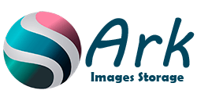
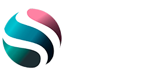

<!-- @format -->

<!-- PROJECT LOGO -->
 

  

  <h3 align="center">Laniakea Store!</h3>

  

    An Coderhouse ReactJS proyect, Camada 16890 rj!
     
     
    <a href="https://github.com/amilcar-laniakea/laniakea-store"><strong>Repo address</strong></a>
     
     
    <a href="https://www.coderhouse.com/">Coderhouse Page</a>
    ·
    <a href="https://plataforma.coderhouse.com/">Platform</a>
  

  
Table of Contents

  <ol>
    <li>
      <a href="#about-the-project">About The Project</a>
      <ul>
        <li><a href="#built-with">Built With</a></li>
      </ul>
    </li>
    <li>
      <ul>
        <li><a href="#installation">Installation</a></li>
      </ul>
    </li>
    <li><a href="#license">License</a></li>
    <li><a href="#contact">Contact</a></li>
  </ol>

  

<!-- ABOUT THE PROJECT -->

## About The Project

Laniakea project made with ReactJS with requirements made of Coderhose platform.

### Built With

Frameword/libraries used:

-  [Ant Design](https://ant.design/)
-  [Carousels with](https://www.npmjs.com/package/react-awesome-swiper)
-  [Meta Descriptions](https://www.npmjs.com/package/react-helmet)
-  [react-router-dom](https://reactrouter.com/web/guides/quick-start)
-  [node sass](https://www.npmjs.com/package/node-sass)

## Getting Started

This is an example of how you may give instructions on setting up your project locally. To get a
local copy up and running follow these simple example steps.

### Installation

1. Clone the Project
2. Make "npm install" for onstall all dependencies
3. Do "npm start" for ron the proyect
4. Proyect is listen in por 3000

<!-- LICENSE -->

## License

Distributed under the MIT License. See `LICENSE` for more information.

<!-- CONTACT -->

## Contact

About me - [@arkhalem](https://twitter.com/ArKhaleM) - amilcar.laniakea@gmail.com

Project Link:
[https://github.com/amilcar-laniakea/laniakea-store](https://github.com/amilcar-laniakea/laniakea-store)

Demo: [https://laniakea-store.herokuapp.com](https://laniakea-store.herokuapp.com)
